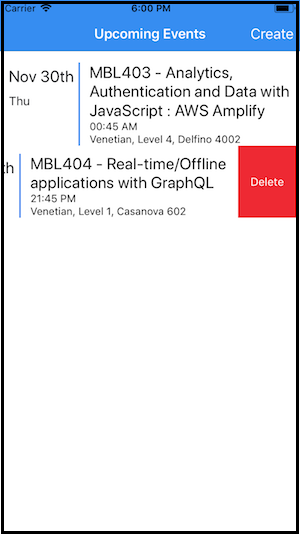

# Introduction

This is a Starter React Native application for using the Sample app in the AWS AppSync console when building your GraphQL API. The Sample app creates a GraphQL schema and provisions Amazon DynamoDB resources, then connects them appropriately with Resolvers. The application demonstrates GraphQL Mutations, Queries and Subscriptions using AWS AppSync. You can use this for learning purposes or adapt either the application or the GraphQL Schema to meet your needs.



## Features

- GraphQL Mutations
  - Create new events
  - Create comments on existing events

- GraphQL Queries
  - Get all events (w/ pagination support)
  - Get an event by Id

- GraphQL Subscriptions
  - Real time updates for comments on an event

- Authorization
  - The app uses API Key as the authoriation mechanism

## AWS Setup

1. Navigate to the AWS AppSync console using the URL: http://console.aws.amazon.com/appsync/home

2. Click on `Create API` and select the `Sample Schema` option. Enter a API name of your choice. Click `Create`.


## React Native Setup

First, clone this repo:

```
git clone https://github.com/aws-samples/aws-mobile-appsync-events-starter-react-native.git
cd ./aws-mobile-appsync-events-starter-react-native
```

Wait until the progress bar at the top has completed deploying your resources. Then from the integration page of your GraphQL API (you can click the name you entered in the left hand navigation). 

On this same page, select `JavaScript` at the bottom to download your `aws-exports.js` configuration file by clicking the **Download Config** button. Replace the `aws-exports.js` file in the root of your app with the file you just downloaded.

Start the application:

```
npm install 
npm run ios   #run-android
```

## Application Walkthrough

### App.js

- Sets up the application navigation between screens using `StackNavigator`.
- Configures the `AWSAppSyncClient` using an API Key. This can be configured to use Amazon Cognito Identity or Amazon Cognito User Pools as well.
- Uses Higher Order Components for making GraphQL calls to AWS AppSync.

### ./Components/AllEvents.js

- View to display all the events from `./queries/ListEvents.js` with a `ScrollView`
- Allows you to delete individual events with a swipe. This will use `./queries/DeleteEvent.js`

### ./Components/AddEvent.js

- View to create a new event using `./queries/CreateEvent.js`

### ./queries Directory

- Contains GraphQL queries and mutations for interacting with AWS AppSync.
- Contains two optional queries (`CommentOnEvent.js` and `GetEvent.js`) for you to enhance the sample.
